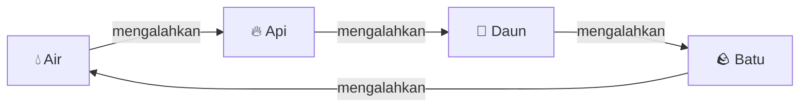
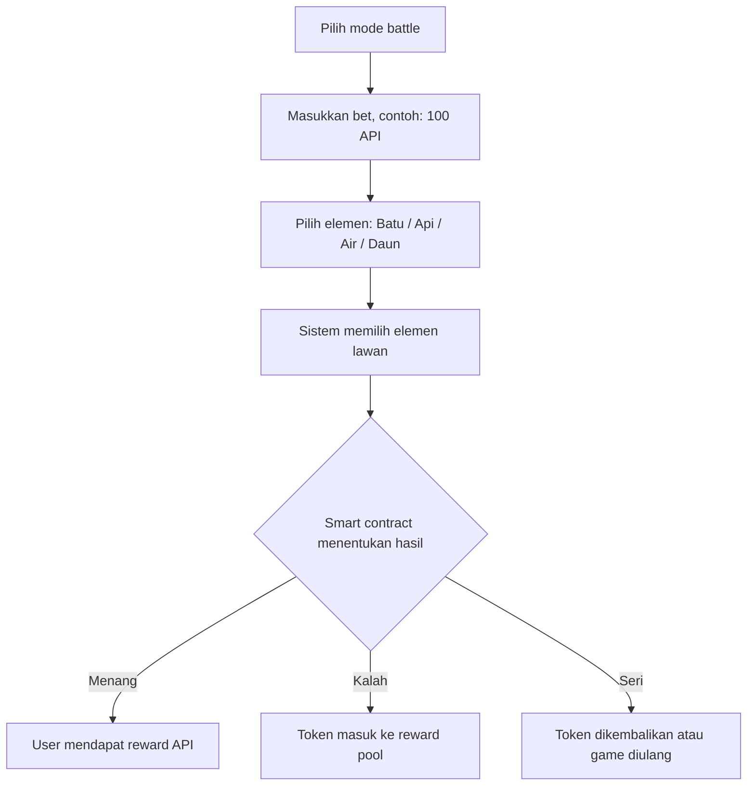

# 🪨🔥 Batu Api — Element Battle on Celo


> **Batu Api** adalah mini game Web3 pertarungan elemen di **Celo Mainnet**. Deposit CELO, dapatkan **API Coin**, pilih elemenmu, dan bertarunglah.

| Aspek | Keterangan |
|---|---|
| **Nama Project** | Batu Api |
| **Genre** | Web3 Mini Game · Element Battle · Casual Strategy Game |
| **Blockchain** | Celo Mainnet (kompatibel EVM) |
| **Token Game** | API Coin (API) |
| **Rasio Token** | 1 CELO = 1000 API Coin · 1000 API Coin = 1 CELO |

## 📑 Daftar Isi

1. [Ringkasan Proyek](#1--ringkasan-proyek)
2. [Latar Belakang](#2--latar-belakang)
3. [Tujuan Proyek](#3--tujuan-proyek)
4. [Konsep Utama](#4--konsep-utama)
5. [Filosofi Nama "Batu Api"](#5--filosofi-nama-batu-api)
6. [Elemen dalam Game](#6--elemen-dalam-game)
7. [Aturan Battle](#7--aturan-battle)
8. [Alur Utama Aplikasi](#8--alur-utama-aplikasi)
9. [Token Economy](#9--token-economy)
10. [Sistem Reward Battle](#10--sistem-reward-battle)
11. [Mode Game](#11--mode-game)

---

## 1. 🎮 Ringkasan Proyek

**Batu Api** adalah game pertarungan elemen berbasis blockchain yang berjalan di **Celo Mainnet**. Pemain menukar CELO menjadi token game bernama **API Coin**, lalu menggunakan token tersebut untuk mengikuti battle elemen.

Rasio utama dalam game:

```text
1 CELO = 1000 API Coin
1000 API Coin = 1 CELO
```

Pemain memilih salah satu dari empat elemen:

- 🪨 **Batu**
- 🔥 **Api**
- 💧 **Air**
- 🌿 **Daun**

Setiap elemen memiliki kekuatan dan kelemahan. Pemain bertarung melawan sistem atau pemain lain. Jika menang, pemain mendapatkan reward berupa API Coin; jika kalah, token masuk ke **reward pool**.

Proyek ini menggunakan Celo Mainnet yang **kompatibel dengan EVM**, sehingga pengembangan smart contract dapat dilakukan dengan **Solidity** dan tooling seperti **Hardhat/Remix**. Celo mendukung pengalaman pengembangan seperti di Ethereum karena kompatibilitas EVM tersebut.

---

## 2. 🌍 Latar Belakang

Game Web3 sering kali terlalu kompleks untuk pengguna baru. Banyak game blockchain memiliki mekanisme token, NFT, marketplace, staking, dan sistem ekonomi yang sulit dipahami.

Batu Api dibuat dengan konsep yang sangat sederhana:

```text
Deposit CELO → Dapat API Coin → Main Battle → Menang/Kalah → Withdraw
```

Dengan konsep ini, pengguna baru dapat langsung memahami cara bermain tanpa harus mengerti sistem DeFi yang rumit.

---

## 3. 🎯 Tujuan Proyek

Tujuan utama Batu Api adalah membuat mini game Web3 yang:

- **Mudah dimainkan.**
- **Mudah dipahami.**
- Menggunakan **token economy sederhana**.
- Berjalan di **Celo Mainnet**.
- Cocok untuk **onboarding pengguna baru** ke Web3 gaming.
- Memiliki mekanisme **deposit dan withdraw yang jelas**.

---

## 4. 💡 Konsep Utama

Fakta inti proyek — nama, genre, blockchain, token game, dan rasio token — dirangkum dalam tabel fakta singkat di bagian pembuka dokumen ini. Bagian ini menjelaskan bagaimana konsep tersebut berjalan dalam permainan.

### Gameplay Singkat

Pemain melakukan deposit CELO dan menerima API Coin. API Coin digunakan untuk mengikuti battle. Dalam battle, pemain memilih satu elemen, sementara sistem memilih elemen secara acak (random). Pemenang ditentukan berdasarkan aturan elemen.

---

## 5. 🔥 Filosofi Nama "Batu Api"

Nama **Batu Api** dipilih karena memiliki karakter yang kuat, lokal, dan mudah diingat.

Makna nama:

| Kata | Makna |
|---|---|
| **Batu** | Kekuatan, pertahanan, ketahanan |
| **Api** | Energi, serangan, keberanian |

Dalam game ini, Batu dan Api menjadi bagian dari dunia pertarungan elemen. Nama ini juga dapat dikembangkan menjadi brand game yang lebih luas, misalnya:

- Batu Api **Arena**
- Batu Api **Battle**
- Batu Api **Forge**
- Batu Api **Element War**

---

## 6. 🌿 Elemen dalam Game

Game memiliki **4 elemen utama**:

| Elemen | Simbol | Karakter |
|---|:---:|---|
| **Batu** | 🪨 | Kuat, defensif, stabil |
| **Api** | 🔥 | Agresif, cepat, menyerang |
| **Air** | 💧 | Fleksibel, menenangkan, mengalahkan api |
| **Daun** | 🌿 | Natural, tumbuh, mengalahkan batu |

---

## 7. ⚔️ Aturan Battle

Aturan pertarungan elemen:

- 💧 **Air** mengalahkan 🔥 **Api**
- 🔥 **Api** mengalahkan 🌿 **Daun**
- 🌿 **Daun** mengalahkan 🪨 **Batu**
- 🪨 **Batu** mengalahkan 💧 **Air**

Jika kedua pihak memilih elemen yang sama, hasilnya **seri (draw)**.

Siklus counter elemen:



### Tabel Hasil Battle

| Player | Lawan | Hasil |
|---|---|---|
| 💧 Air | 🔥 Api | ✅ Player **menang** |
| 🔥 Api | 🌿 Daun | ✅ Player **menang** |
| 🌿 Daun | 🪨 Batu | ✅ Player **menang** |
| 🪨 Batu | 💧 Air | ✅ Player **menang** |
| 🔥 Api | 💧 Air | ❌ Player **kalah** |
| 🌿 Daun | 🔥 Api | ❌ Player **kalah** |
| 🪨 Batu | 🌿 Daun | ❌ Player **kalah** |
| 💧 Air | 🪨 Batu | ❌ Player **kalah** |
| Elemen sama | Elemen sama | 🤝 **Draw / seri** |

---

## 8. 🔄 Alur Utama Aplikasi

### 8.1 Alur Deposit

1. User membuka website Batu Api.
2. User melakukan connect wallet.
3. User memilih menu **Deposit**.
4. User memasukkan jumlah CELO.
5. Smart contract menerima CELO.
6. Smart contract melakukan **mint** API Coin ke wallet user.
7. Saldo API Coin tampil di dashboard.

**Contoh:**

```text
User deposit 1 CELO  →  User menerima 1000 API Coin
```

### 8.2 Alur Battle

1. User memilih mode battle.
2. User memasukkan bet, contoh **100 API**.
3. User memilih elemen: Batu / Api / Air / Daun.
4. Sistem memilih elemen lawan.
5. Smart contract menentukan hasil battle:
   - Jika user **menang** → user mendapat reward API.
   - Jika user **kalah** → token masuk ke reward pool.
   - Jika **seri** → token bisa dikembalikan atau game diulang.



### 8.3 Alur Withdraw

1. User membuka menu **Withdraw**.
2. User memasukkan jumlah API Coin.
3. Smart contract melakukan **burn** API Coin.
4. Smart contract mengirim CELO ke wallet user.

**Contoh:**

```text
User withdraw 1000 API  →  User menerima 1 CELO
```

---

## 9. 💰 Token Economy

| Aspek | Nilai |
|---|---|
| **Token Name** | API Coin |
| **Token Symbol** | API |
| **Conversion Rate** | 1 CELO = 1000 API |

### Formula Deposit

```text
API yang diterima = CELO yang disetor × 1000
```

Contoh:

| Deposit CELO | API Coin |
|---:|---:|
| 0.1 CELO | 100 API |
| 0.5 CELO | 500 API |
| 1 CELO | 1000 API |
| 5 CELO | 5000 API |
| 10 CELO | 10000 API |

### Formula Withdraw

```text
CELO yang diterima = API yang ditukar / 1000
```

Contoh:

| Withdraw API | CELO |
|---:|---:|
| 100 API | 0.1 CELO |
| 500 API | 0.5 CELO |
| 1000 API | 1 CELO |
| 5000 API | 5 CELO |

---

## 10. 🏆 Sistem Reward Battle

### Entry Fee

Contoh entry battle: **100 API per battle**.

### Reward Jika Menang

Terdapat tiga opsi skema reward:

#### Opsi 1 — Fixed Reward

| Kondisi | Hasil |
|---|---|
| Bet | 100 API |
| Menang | Mendapat **180 API** |
| Kalah | Kehilangan 100 API |
| Draw | 100 API dikembalikan |

> Sisa **20 API** dapat dialokasikan ke reward pool / treasury / biaya operasional.

#### Opsi 2 — Double or Nothing

| Kondisi | Hasil |
|---|---|
| Bet | 100 API |
| Menang | Mendapat **200 API** |
| Kalah | Kehilangan 100 API |
| Draw | 100 API dikembalikan |

> Opsi ini lebih sederhana, tetapi perlu kehati-hatian agar pool contract selalu cukup untuk membayar reward.

#### Opsi 3 — Reward Pool

- User **kalah** → token masuk ke reward pool.
- User **menang** → reward dibayar dari reward pool.

> Opsi ini lebih cocok untuk hackathon karena dapat dijelaskan sebagai sistem ekonomi game.

---

## 11. 🕹️ Mode Game

### 11.1 Player vs System

Mode paling sederhana untuk **MVP**:

1. User memilih elemen.
2. Sistem memilih elemen secara random.
3. Smart contract menentukan hasil.

**Kelebihan:**

- Cepat dibuat.
- Cocok untuk demo.
- Tidak memerlukan matchmaking.

### 11.2 Player vs Player *(pengembangan selanjutnya)*

Mode pertarungan antar pemain — sebagaimana disinggung pada [Ringkasan Proyek](#1--ringkasan-proyek) — direncanakan sebagai pengembangan tahap berikutnya. Detail mekanismenya belum ditetapkan dan akan didokumentasikan saat mode ini dirancang.

---

<p align="center">
  🪨🔥💧🌿<br>
  <b>Batu Api</b> — satu rasio, empat elemen, satu battle: gerbang sederhana menuju Web3 gaming di Celo.
</p>
